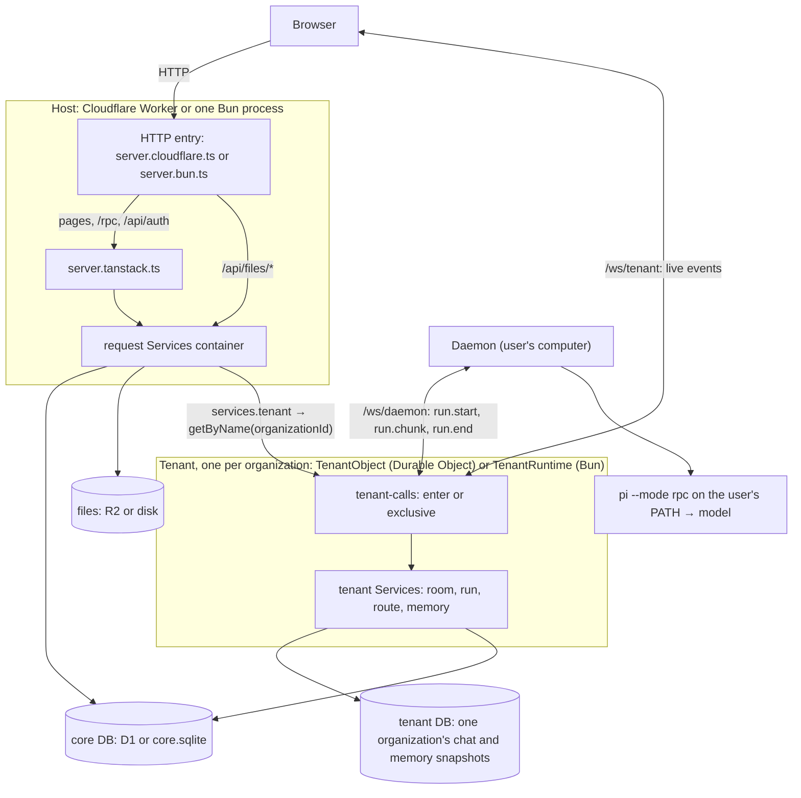
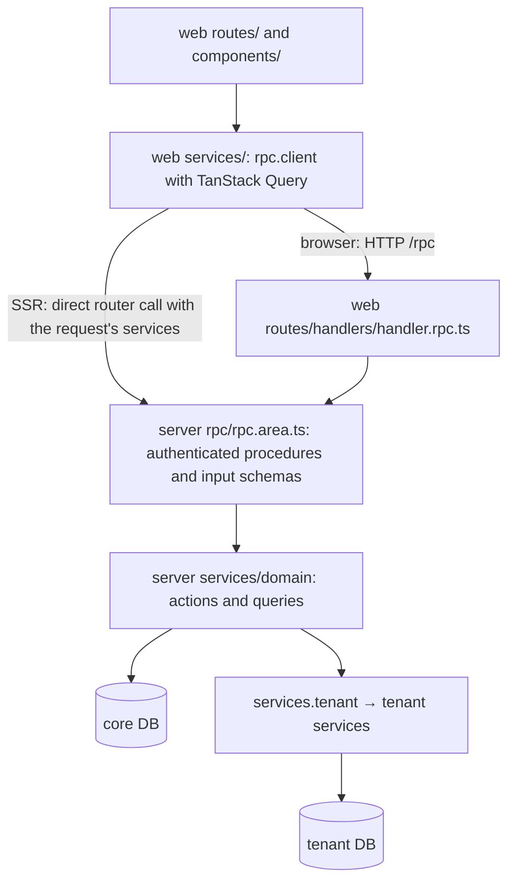
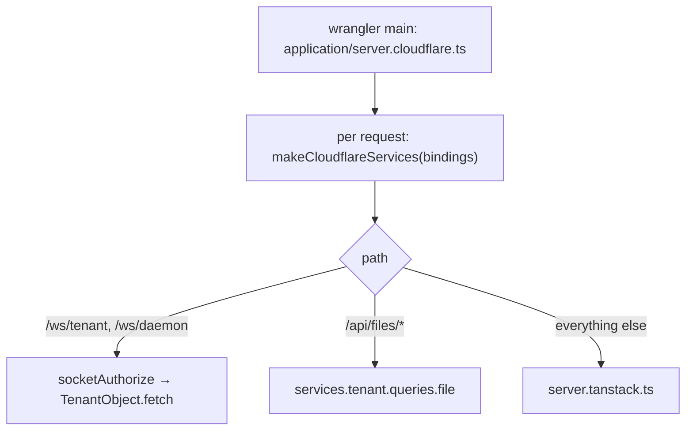
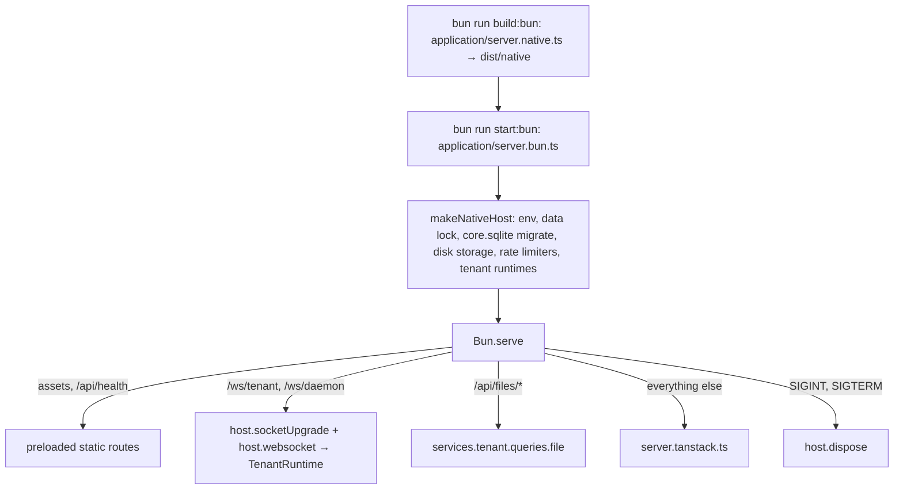
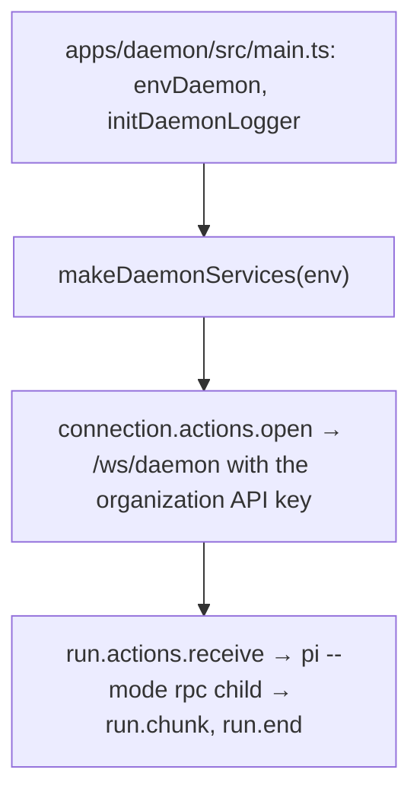

# Architecture

## Rules for this file

1. Agents do not edit this file. Only the user edits it, or an agent the user explicitly allowed for that one change.
2. Drifting from these concepts is forbidden. This file describes the allowed target: code that does not match is fixed in the same change, never written down here.
3. Files and folders that match a pattern listed here are allowed, new domain folders included. A new pattern, file kind, package or concept needs the user's approval first, and its line lands in the same change. README, `.gitignore`, `.github`, lockfiles and generated files are not file kinds.
4. A tree line is a name pattern plus what it holds, in about 15 words.
5. No history, dates, owners, feature behaviour or workflows. Skills own workflows and point to this file.
6. Before writing a file, read a few sibling files of the same kind and follow them.

## 1. How Orbs works

Orbs is a multi-bot chat app. People talk to bots in rooms; each bot's turn runs on the user's own computer, in a daemon that drives the Pi harness. The same app runs on Cloudflare (Workers, D1, R2, Durable Objects) or as one Bun process (SQLite and disk).

### System

Browsers and the daemon talk to the host; every organization has one tenant that owns its chat.



### Layers

Each layer lives in one place and only calls the layer below it.



### Boot: Cloudflare

Wrangler runs the Worker entry; every request builds its own services from the bindings.



### Boot: Bun

Vite builds one bundle; the Bun server loads it, starts the native host once, then serves.



### Boot: daemon

The daemon connects out to the host and runs every turn it receives through the user's `pi` in RPC mode.



### Entry files

| File | Runs on | Intent |
| --- | --- | --- |
| web `application/router.tsx` | browser and SSR | creates the TanStack router and the Query client |
| web `application/routes.ts` | build | route table: every page and handler file is registered here |
| web `application/routes.tree.ts` | build | generated from `routes.ts` by the TanStack Vite plugin, never edited |
| web `application/server.tanstack.ts` | both hosts | shared request handler: middlewares and SSR, no platform code |
| web `application/server.cloudflare.ts` | Cloudflare | Worker entry: services from bindings, sockets, files, then TanStack; re-exports `TenantObject` |
| web `application/server.native.ts` | Bun, bundled | native Vite entry: bundles `makeNativeHost` with the handler so they share one module graph |
| web `application/server.bun.ts` | Bun process | loads the bundle, serves assets, runs `Bun.serve`, shuts down |
| web `application/styles.css` | browser | Tailwind entry and theme tokens |
| server `entry.client.ts` → `@orbs/server/client` | anywhere | browser-safe constants, schemas, pure utils and types |
| server `entry.server.ts` → `@orbs/server/server` | server only | `Services` type, RPC handler, security helpers |
| server `rpc/rpc.router.ts` → `@orbs/server/rpc` | server only | the router, imported only by `rpc.client.ts` for SSR calls |
| server `entry.daemon.ts` → `@orbs/server/daemon` | daemon | daemon protocol schemas and `createContainer` |
| server `entry.cloudflare.ts` → `@orbs/server/cloudflare` | Cloudflare | `makeCloudflareServices` and `TenantObject`, imported only by `server.cloudflare.ts` |
| server `entry.native.ts` → `@orbs/server/native` | Bun | `makeNativeHost`, imported only by `server.native.ts` |
| daemon `src/main.ts` | Bun, user's computer | process entry: `envDaemon`, logger, container, `/ws/daemon`, shutdown on signals |

### Naming

- Files are kebab-case and start with their domain: `room-action.send.ts`, `room.constants.ts`, `bot-avatar.tsx`.
- Exports start with their file's domain: `roomActionSend`, `ROOM`, `makeRoomService`, `BotAvatar`.
- Native domain implementations have no suffix; Cloudflare variants name their platform: `storage-cloudflare.driver.ts`, `database-d1.service.ts`, `database-durable.service.ts`. Host entry files keep the names in the trees.

## 2. Project structure

### Module pattern (apps/server, apps/daemon)

```
src/
├── core/
│   └── core.services.ts               make*Services: every container, wiring services from injected deps
├── services/
│   └── <d>/                           one flat folder per domain
│       ├── <d>.service.ts             exports only make<D>Service and its inferred <D>Service type
│       ├── <d>-<part>.service.ts      platform variant (database-d1) or a part the domain uses (tenant-calls)
│       ├── <d>-action.<name>.ts       one write, exported as <d>Action<Name>(deps, params)
│       ├── <d>-query.<name>.ts        one read, exported as <d>Query<Name>(deps, params); no writes or sends
│       ├── <d>.constants.ts           at most one: every config value, limit and lookup table
│       ├── <d>.utils.ts               at most one: helpers shared by 2+ files or exposed through an entry
│       ├── <d>.driver.ts              native driver, private to the domain
│       ├── <d>-cloudflare.driver.ts   Cloudflare driver, private to the domain
│       ├── <d>.prompts.ts             prompt builders, route and run only
│       └── <d>.options.ts             library options, auth only (Better Auth)
│       └── <d>.bridge.ts              Pi side running inside the spawned pi, pi only
└── types/
    └── <d>[-<part>].types.ts          types and zod schemas of one domain, no functions
```

### apps/server

Module pattern, plus:

```
apps/server/
├── package.json  tsconfig.json  vitest.config.ts
├── tests/                              see apps/server/tests
└── src/
    ├── entry.client.ts                 @orbs/server/client: browser-safe constants, schemas, pure utils, types
    ├── entry.server.ts                 @orbs/server/server: Services type, RPC handler, security helpers
    ├── entry.daemon.ts                 @orbs/server/daemon: daemon protocol schemas and createContainer
    ├── entry.cloudflare.ts             @orbs/server/cloudflare: makeCloudflareServices and TenantObject
    ├── entry.native.ts                 @orbs/server/native: makeNativeHost
    ├── core/
    │   ├── core.container.ts           createContainer and Factories: lazy factories with overrides
    │   ├── core.services.ts            makeServices (per request) and makeTenantServices (per organization)
    │   └── core.tenant-runtime.ts      native tenant: queue, sockets, alarm, one runtime per organization
    ├── rpc/                            flat until about 40 files
    │   ├── rpc.<area>.ts               one router area: each procedure makes one service call
    │   ├── rpc.router.ts               @orbs/server/rpc: lazy router of every area
    │   ├── rpc.procedures.ts           guestProcedure, authedProcedure, adminProcedure
    │   ├── rpc.middlewares.ts          base router, auth and rate-limit middlewares
    │   ├── rpc.handler-http.ts         oRPC fetch handler for /rpc
    │   ├── rpc.utils.ts                shared RPC helpers
    │   └── rpc.constants.ts            RPC config values
    ├── services/
    │   └── database/migrations/
    │       ├── core/NNNN_snake_name.sql      core DB schema changes
    │       └── tenant/NNNN_snake_name.sql    tenant DB schema changes
    └── types/
```

### apps/daemon

Module pattern, plus:

```
apps/daemon/
├── package.json  tsconfig.json  .env  .env.example
└── src/
    ├── main.ts                         process entry: env, logger, container, connection, signals
    ├── core/core.services.ts           makeDaemonServices
    ├── services/<d>/                   harness adapters (pi) are domains too
    └── types/
```

### apps/web

```
apps/web/
├── package.json  tsconfig.json  vite.config.ts  wrangler.jsonc  components.json
├── .env  .env.example                  local values and their key list
├── .env.production  .prod.vars         production values; .prod.vars is a symlink to .env.production for Wrangler
├── public/                             static files: favicon, fonts, img
├── vite/<name>.vite.ts                 one Vite plugin config each
└── src/
    ├── application/
    │   ├── router.tsx                  TanStack router and query client
    │   ├── routes.ts                   route table, every route file is registered here
    │   ├── routes.tree.ts              generated, never edited
    │   ├── server.tanstack.ts          shared TanStack handler: middlewares and SSR
    │   ├── server.cloudflare.ts        Worker entry: re-exports TenantObject; services, sockets, files, then TanStack
    │   ├── server.native.ts            native bundle entry: makeNativeHost and the TanStack handler
    │   ├── server.bun.ts               Bun process: assets, Bun.serve, sockets, shutdown
    │   └── styles.css                  Tailwind entry and theme tokens
    ├── assets/<group>/                 imported assets
    ├── components/
    │   ├── <area>/<area>-<name>.tsx    one component, exported as <Area><Name>; file may use the singular area
    │   └── ui/                         vendored shadcn, never edited
    ├── context/<name>.ts               createContext declarations only
    ├── hooks/use-<name>.ts             one hook, exported as use<Name>
    ├── lib/<name>.ts                   portable helpers: no app imports, only its own types/<name>.types.ts
    ├── routes/
    │   ├── root.tsx  index.tsx  <name>.layout.tsx
    │   ├── <area>/<area>.layout.tsx            area layout
    │   ├── <area>/<area>.index.tsx             area index page
    │   ├── <area>/<area>.<segment>[.<segment>].tsx    one page per dotted path, $param segments, wires components
    │   └── handlers/handler.<name>.ts          raw server route: /rpc, auth, robots, sitemap, ingest
    ├── services/
    │   ├── rpc/rpc.client.ts           the one RPC client: browser over /rpc, SSR direct
    │   └── <d>/
    │       ├── <d>.client.ts           public domain API, usable in SSR and browser
    │       ├── <d>.server.ts           server-only domain API
    │       ├── <d>.rsc.{ts,tsx}        React Server Component API
    │       ├── <d>-action.<name>.{client,server}.ts    one stateful write
    │       ├── <d>-query.<name>.{client,server}.ts     one stateful read
    │       ├── <d>.utils.ts            helpers shared by 2+ files
    │       └── <d>.constants.ts        config values and label tables
    ├── types/<d>.types.ts              web types; server shapes derived from server entries
    └── vite-env.d.ts
```

### packages

New packages and new exports follow `src/entry.<runtime>.ts` → `./<runtime>`, where runtime is `client`, `server`, `daemon`, `vite` or `universal`; one entry is fine. An extra subpath exists only when one entry would pull a bigger module graph than callers want. Internals keep their names and folders and stay lean.

```
packages/
├── avatar-blobs/                       SVG avatar engine: ./decor ./engine ./expressions ./gaze ./math ./player ./skins ./states ./viewbox
├── env/                                env schemas: ./server ./daemon
├── errors/                             Errors classes and codes: ./universal
├── i18n/                               Paraglide copy: ./client ./server ./vite ./config ./validation ./runtime ./messages
├── kysely-sqlite/                      Kysely dialect for bun:sqlite: ./server
├── logger/                             logger per runtime: ./client ./server ./daemon
├── tanstack-helpers/                   head, metadata, JSON-LD and URL helpers: ./universal
├── tooling/                            ./vitest/arch; src/oxlint/ is read by the root oxlint config
└── typescript-config/                  base.json and react.json tsconfig presets
```

### apps/server/tests

```
apps/server/tests/
├── test.ts                             shared test API and fixtures
├── architecture/<topic>.test.ts        architecture contracts
├── factories/
│   ├── factory.ts  index.ts            defineFactory and the bound factory set
│   └── <entity>.factory.ts             row factory
├── kits/
│   ├── kit.ts                          defineKit
│   └── <domain>.kit.ts                 real services with boundary mocks
├── mocks/
│   ├── index.ts                        the boundary mock set
│   └── <thing>.mock.ts                 boundary mock: bucket, rate limit, tenant
├── scenarios/
│   ├── index.ts                        the bound scenario set
│   └── <domain>.scenarios.ts           multi-row domain setup
├── support/<thing>.ts                  test database, env, services, auth, rpc
├── rpc/rpc.<area>.test.ts              RPC wire tests
└── services/<d>/                       service tests
```

### Root

```
./
├── package.json  turbo.json  bunfig.toml  oxlint.config.ts  vitest.config.ts  .fallowrc.json  paseo.json
├── AGENTS.md                           agent instructions
├── CLAUDE.md                           link to AGENTS.md
├── DESIGN.md                           visual design
├── scripts/
│   ├── utils-<name>.ts                 dev tool, run as bun scripts/utils-<name>.ts
│   └── web-<name>.ts                   web deploy and seed step
└── .agents/
    ├── tasks.md                        local only (gitignored), like plans/ and research/
    ├── references/                     standing references: architecture, quality gate
    ├── plans/                          plans for larger work
    ├── research/                       research notes
    └── skills/                         project skills
```

### Scripts

Apps name scripts `<task>:<platform>`, where the platform is where the artifact runs; every app uses the same names for the tasks it has. The root `package.json` only forwards to turbo, so `bun run dev:cloudflare` starts every app's `dev:cloudflare`. Only `lint`, `lint:fix` (they also lint `scripts/`) and `test:coverage` do more.

| Script | `apps/web` | `apps/daemon` |
| --- | --- | --- |
| `dev:cloudflare` | `vite dev` | watch `src/main.ts` |
| `dev:bun` | native build, then `server.bun.ts` | watch `src/main.ts` |
| `build:cloudflare` | Worker build to `dist/` | — |
| `build:bun` | native bundle to `dist/native/` | compiled binary to `dist/` |
| `start:bun` | `server.bun.ts` | `src/main.ts` |
| `preview:cloudflare` | `vite preview` | — |
| `deploy:cloudflare` | build, secrets check, D1 migrations, deploy | — |

- Every package also has `check`, `lint` and `lint:fix`; `apps/server` has `test`.
- A root shortcut is `turbo run <script> --filter=<app>`: `build:web`, `build:daemon`.
- App-only scripts stay in their app and are not forwarded: web `db:migrate`, `db:seed`, `secrets:push`, `secrets:check`, `deploy:first`, `cf-typegen`.
- Every web script serves on port 47101 and the daemon connects to `http://localhost:47101` by default; a different port goes through `--port`, never an env.

## 3. Standards

- **Fewer files.** Would this fit in an existing file? Use it. Is that file already doing too much? Reconsider, and only then split.
- **No single-use extraction.** A helper used once stays inline in its owner; config values still go to `<d>.constants.ts`. Operation, type and migration files stay their own files even when used once.
- **Helpers.** Operation-only helpers stay nested inside the operation that uses them. Web runtime entries (`.client`, `.server`, `.rsc`) hold several domain-prefixed operations. Factories exist only for real state, injection or lifetimes.
- **Dependency injection.** A container builds every service from injected deps, and every container takes `overrides`, so any service can be swapped, like a Laravel container or Effect layers. Services get infrastructure from their deps or from the source the host passes; they never read globals.
- **Data ownership.** Core DB: accounts, organizations, bots and memory rows. Tenant DB: one organization's chat and memory snapshots, written only through its tenant. Request services reach the tenant through `services.tenant`.
- **Platform split.** Host code lives in `entry.cloudflare.ts`, `entry.native.ts` and `core.tenant-runtime.ts`. Inside a domain, use the smallest shape: a short inline branch (`rate-limiter`), a driver pair picked with `ts-pattern` (`mail`, `storage`), or a `<d>-<part>.service.ts` the host calls (`database-d1`). Bindings appear only in Cloudflare files.
- **Env.** Add a variable only when the value really differs per machine or deploy; anything else is a constant. Every variable is declared in `@orbs/env` (`./server`, `./daemon`), parsed by the host or process entry and passed down as `env`. A variable with a working default lives only in the schema (`.default()`); it enters `.env.example` only when someone must set it. Values live in each app's `.env`, listed in `.env.example`. Production values live in `apps/web/.env.production`, uploaded as Cloudflare secrets through its `.prod.vars` symlink. Only `vite.config.ts` (build-time `VITE_*`) and `scripts/` read their own variables.
- **Entries.** Apps reach other apps and packages only through their `exports`. Web `.tsx` reaches the server only through `@orbs/server/client`. Handlers and `rpc.client.ts` use `@orbs/server/server` and `@orbs/server/rpc`; handlers never import `@orbs/server/client`.
- **Protocols.** Daemon messages (`daemonServerMessage`, `daemonClientMessage`) live in server `types/daemon.types.ts`, exported by `@orbs/server/daemon`. Browser events (`tenantEvent`) live in server `types/tenant.types.ts`; web `tenant-action.subscribe.client.ts` parses them and `tenant-action.sync.client.ts` applies them to the cache.
- **Types.** App types and schemas live in `types/<d>[-<part>].types.ts`. Derive server-owned shapes from server entries with `Pick`, `Omit` and `Extract`. Component props stay in their `.tsx`, inferred service types beside their factory.
- **Validation.** Parse RPC input, socket messages, env and serialized database fields with zod at their boundary. Kysely types describe database rows; code inside stays typed. The one exception is `pi.bridge.ts`: it runs inside the user's `pi`, which gives extensions typebox and not zod, so it uses typebox for its tool parameters and parsing.
- **Utils and constants.** `<d>.utils.ts` holds helpers shared by two or more files or exposed through an entry. `<d>.constants.ts` holds every config value, limit and lookup table, even one read once.
- **Errors, logs, copy.** Throw `Errors.<CODE>` from `@orbs/errors/universal`, log with `@orbs/logger/<runtime>`, and write user copy as English keys in `packages/i18n/messages/en/<area>.json`, read with `m.<key>()`.
- **Framework first.** Use what TanStack, oRPC, Better Auth and Kysely already offer before writing your own. In the daemon, use Pi's own options (tools, compaction, retries, skills) before adding a guard around a turn.

Not allowed: `process.env` outside host and process entries (except the two above), typebox outside `<d>.bridge.ts`, business logic, SQL or a second service call in `rpc/`, importing another domain's actions, queries or drivers, comments other than `// SAFETY:` above a type assertion.

## 4. Playbook

- **Env variable:** add it to `@orbs/env` (`entry.server.ts` or `entry.daemon.ts`) and to the app's `.env.example`, then read `env.<NAME>` from deps.
- **RPC procedure:** input schema in `types/<d>.types.ts`, procedure in `rpc/rpc.<area>.ts` on `guestProcedure`, `authedProcedure` or `adminProcedure`; the handler makes one service call.
- **Operation:** `<d>-action.<name>.ts` or `<d>-query.<name>.ts` taking `(deps, params)`, wired in `<d>.service.ts`.
- **Domain:** `services/<d>/<d>.service.ts`, its deps type in `types/<d>.types.ts`, registered in the request or tenant container in `core/core.services.ts`.
- **Tenant call:** a `services/tenant` operation that calls `deps.namespace.getByName(organizationId)`, the method on `TenantCalls` in `types/tenant.types.ts`, its `enter` or `exclusive` line in `tenant-calls.service.ts`, and the same method on `TenantObject`. Bun reaches `services.calls` directly.
- **Page:** a file in `routes/<area>/` with `createFileRoute`, registered in `application/routes.ts`; the loader uses `ensureQueryData` and the component only wires components from `components/<area>/`. `routes.tree.ts` regenerates on the next dev or build. New data needs an RPC procedure; new text needs i18n keys.
- **Raw API route:** `routes/handlers/handler.<name>.ts` with `server.handlers`, registered in `routes.ts` the same way; it never imports `@orbs/server/client`.
- **Server data in web:** `rpc.<area>.<procedure>.queryOptions()` or `.mutationOptions()` with TanStack Query.
- **User copy:** a key in `packages/i18n/messages/en/<area>.json`, read with `m.<key>()` from `@orbs/i18n/client` or `@orbs/i18n/server`.
- **Platform dependency:** pick the smallest shape from Platform split.
- **Schema change:** a migration in `migrations/core` or `migrations/tenant`, and its columns in `database.types.ts` or `database-tenant.types.ts`.
- **Error code:** add it in `packages/errors/src/schemas.ts`.
